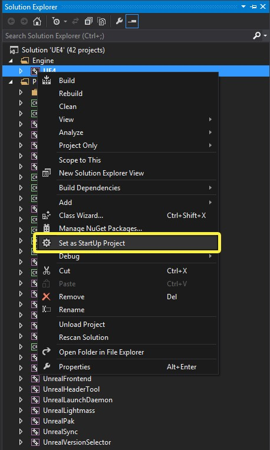
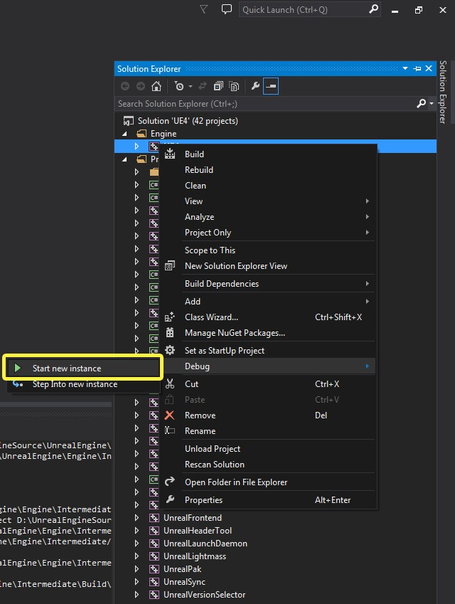
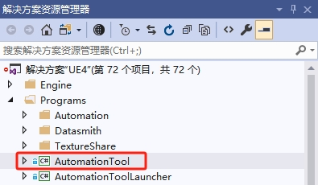

[模拟引擎](https://github.com/OpenHUTB/hutb)
=============

该模拟引擎专为影视级机器人开发而设计，并支持目前正在开发中的一系列项目。其长期目标是保持不断发展、完全现代化的第九代引擎，提供可与专有解决方案相媲美的行业级模拟和渲染吞吐量，同时持续改进性能、稳定性和图形管线，以适应当前的主机硬件目标。

此引擎分支的目标是提供性能最佳、适用于商用项目的公共引擎。

在功能方面，模拟引擎优先采用久经考验的 AAA 级技术，而不是 Epic 自研的 UE5 系统。这包括 PhysX 及其全面的 SDK 功能集（破坏、布料、载具、粒子）、DDGI、标准全光线追踪、TressFX、HBAO4+、SMAA、路径追踪以及其他行业标准解决方案。

Epic 的 UE 5.7/5.8 版本在 PS5 上以 720p-1080p 的低动态内部分辨率运行，目标帧率约为 60 FPS ，这已在已发售的游戏中得到验证。其对几何体、阴影、纹理和重建分辨率的虚拟化处理方式增加了处理、流式传输和内存开销。时间重建、降噪和随机采样引入了噪点、重影、不稳定和模糊。与 UE4 相比，Substrate、GPU 场景、RDG、更复杂的着色器模型和功能扩展进一步增加了基础渲染器的开销、着色器排列、字节码、PSO 数量、编译时间和缓存大小。除了 Chaos 之外，CPU 开销还包括更繁重的场景维护、GPU 场景上传、Lumen 更新、Nanite 流式传输、VSM 失效、世界分区以及渲染线程/RHI 工作负载，这些都会影响目标硬件上的视觉清晰度和 VR 的响应速度。少数几款性能表现尚可的“UE5”引用并非 Epic Games 公开发布的 UE5 引擎，而是一些公司自行开发的引擎分支，这些分支回退到了 UE4 时代的特性，例如 Embark 的 [DDGI、SSGI、PhysX 3]（《The Finals》和《Arc Riders》），以及 Riot Games 的[修改版早期 UE4 时代前向移动渲染器]（《Valorant》和《2XKO》）。其他非 Epic Games 开发的虚幻引擎私有版本还包括 Havok，它完全替代了Chaos（微软）。此外，任天堂 Switch 2 的发布、处理能力远逊于 PlayStation 5 的掌上设备的兴起、Valve 推出的 Steam Machine 和 Steam Deck 等硬件，以及人工智能需求推动的组件成本上涨，都表明 UE5 的性能目标与当前及未来大众市场硬件的兼容性日益下降。因此，其渲染堆栈可能更适合电影、虚拟制作和高端 PC 体验，而非面向各类消费设备的长期可持续应用开发，特别是机器人学习算法的的开发与验证。

与 UE5 不同，模拟引擎的目标是在主机级硬件上运行光线追踪的同时，提供相对于计算成本而言最高的视觉和物理保真度，并保持严格的帧时间预算和高原生分辨率。


## 构建步骤
1. 在终端中，导航到要保存引擎的位置并克隆引擎仓库：
    ```shell
    git clone https://github.com/OpenHUTB/engine.git
    ```
注意：尽可能使引擎文件夹靠近根目录，因为如果路径超过一定长度，则会在步骤 2 中的 `Setup.bat` 返回错误。

2. 运行配置脚本：
    ```shell
    Setup.bat
    GenerateProjectFiles.bat
    ```
    
3. 编译修改后的引擎：
使用 Visual Studio 2019 打开源文件夹内的文件 `UE4.sln`。
在构建栏中，确保已选择`Development Editor`、`Win64`和`UnrealBuildTool`选项。如果需要任何帮助，请查看本指南。
在解决方案资源管理器中，右键单击 `UE4` 并选择`生成`（`Build`）。


4. 编译解决方案后，可以打开引擎，通过启动可执行文件 `Engine\Binaries\Win64\UE4Editor.exe` 来检查所有内容是否已正确安装。

    笔记：如果安装成功，引擎的版本选择器应该能够识别。可以通过右键单击任何 `.uproject` 文件并选择 `Switch Unreal Engine version` 来检查这一点。应该会看到一个弹出窗口，显示`Source Build at PATH`，这里 PATH 是选择的安装路径。如果您在右键单击文件 `.uproject` 时看不到此选择器 `Generate Visual Studio project files`，则引擎安装出现问题，可能需要重新正确安装（双击运行`engine/Engine/Binaries/Win64/UnrealVersionSelector-Win64-Shipping.exe`能达到同样的效果）。

    重要：到目前为止发生了很多事情。强烈建议在继续之前重新启动计算机。

5. （可选）运行编辑器

    将启动项目设置为 UE4。


    


    右键单击 UE4 项目，将鼠标悬停于"Debug" 上，然后 单击"启动新实例（Start New Instance）" 以启动编辑器（或者，你可以按键盘上的 F5键 来启动编辑器的新实例）。

    


## 发布安装版本
参考[链接](https://github.com/chiefGui/ue-from-source?tab=readme-ov-file#step-by-step-1) 进行引擎的发布。

1. 使用 Visual Studio 打开 `UE4.shn` 。
2. 在右侧边栏，您应该会看到一个`解决方案资源管理器`面板。展开`Programs`文件夹并找到`AutomationTool`项目（`Engine\Source\Programs\AutomationTool`）：



3. 右键单击它并选择`生成(Build)`，应该很快。

### 运行安装软件的构建脚本
1. 安装 [Windows 10 SDK](https://developer.microsoft.com/en-us/windows/downloads/windows-10-sdk) ;

2. 运行根目录下的安装构建脚本`GenerateInstalledBuild.bat`。

如果一切顺利，您应该会看到`LocalBuilds`与该文件夹处于同一级别的`Engine`文件夹，并且控制台中没有错误。(还包括一个 InstalledDDC 文件夹：DerivedDataCache)。


### 文档

1. [下载](https://www.doxygen.nl/download.html)并安装doxygen；
2. 打开终端，进入引擎项目主目录，执行：
```shell
cd engine
doxygen
```


### 问题
```text
ERROR: Visual Studio 2017 must be installed in order to build this target.
```
解决：下载`3d5_VisualStudio20171509.rar`进行安装。


```text
Unable to find installation of PDBCOPY.EXE
```
解决：参考 [链接](https://arenas0.com/2018/12/03/UE4_Learn_Build_Binary/) 从 [百度网盘](https://pan.baidu.com/s/1Y0PQeHCMQh7Ln12d_p_Rzw) 下载`X64 Debuggers And Tools-x64_en-us.msi`安装。

```text
无法启动此程序，因为计算机中丢失XINPUT1_3.dll。尝试重新安装该程
```
解决：参考 [链接](http://www.codefaq.cn/category/Windows/) 安装 DirectX Redist (June 2010)。


## 内容
引擎源码的构成。

### 编译
[编译配置参考](https://docs.unrealengine.com/4.26/zh-CN/ProductionPipelines/DevelopmentSetup/BuildConfigurations/)

### 像素流插件
相关源码位于：`unreal\Engine\Plugins\Media\PixelStreaming\PixelStreaming.uplugin`

### 编辑器界面汉化
资源存储位置：`engine\Engine\Content\Localization\Editor\zh-Hans`，只需使用文本编辑器（例如 Notepad++）编辑`Editor.archive`。


## 问题
* 右键`.uproject`文件没有`Switch Unreal Engine version...`
解决：双击`Engine\Binaries\Win64\UnrealVersionSelector-Win64-Shipping.exe`，出现`Register this directory as an Unreal Engine installation?`后点击`是(Y)`。

* 增加`matlab`插件进行引擎编译，导致启动编辑器启动失败，原因不明。


## 参考链接
* [UE4初学者系列教程合集-全中文新手入门教程](https://www.bilibili.com/video/BV164411Y732/?share_source=copy_web&vd_source=d956d8d73965ffb619958f94872d7c57  )

* [ue4官方文档](https://docs.unrealengine.com/4.26/zh-CN/)

* [官方讨论社区](https://forums.unrealengine.com/categories?tag=unreal-engine)

* [知乎的虚幻引擎社区](https://zhuanlan.zhihu.com/egc-community)

* [UnrealEngineVite-PhysX](https://github.com/GapingPixel/UnrealEngineVite-PhysX)
